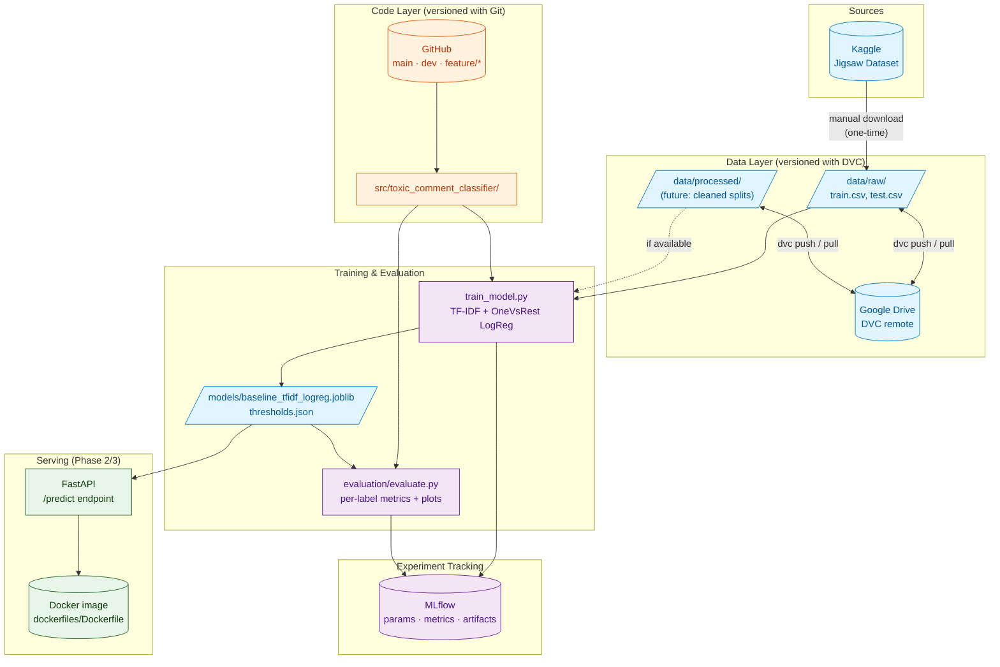
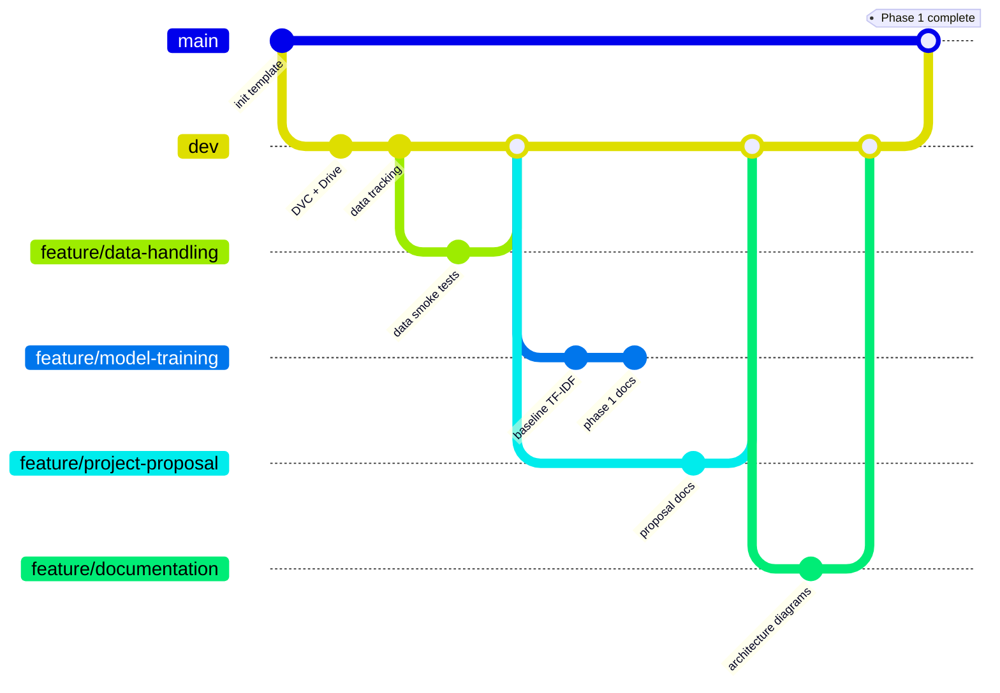
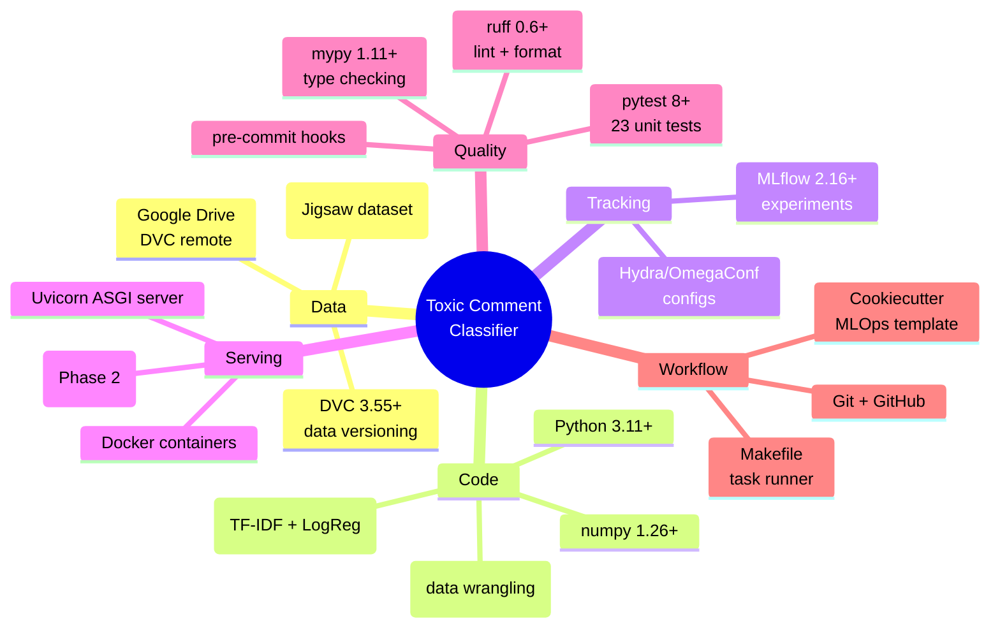
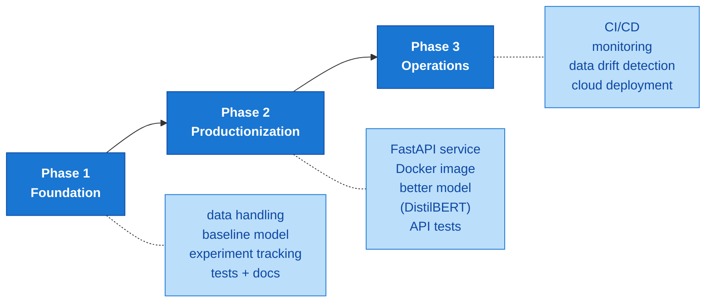

# Toxic Comment Classifier — Architecture

A multi-label text classifier built on the Jigsaw Toxic Comment Classification Challenge dataset, with a full MLOps pipeline including experiment tracking, data versioning, containerization, and a serving API.

---

## System Overview

The system is split into five layers that communicate through well-defined interfaces. Each layer can evolve independently — the data team can change preprocessing without breaking training, the model team can swap algorithms without breaking serving, and the ops team can change deployment without breaking development.



**How to read this:** solid arrows are data/control flow that exists today. Dashed arrows are conditional (e.g., the training script prefers `data/processed/` if it exists, falls back to `data/raw/`). The dashed Phase 2/3 box on serving is on the roadmap, not yet implemented.

---

## Training Pipeline (Phase 1)

This is the part that's running today. Take a CSV of labelled comments, learn a model, save it.

```mermaid
flowchart LR
    A[/"train.csv<br/>159,571 rows<br/>6 toxicity labels"/] --> B["80/20 split<br/>seed=42"]
    B --> T["train (~127K)"]
    B --> V["val (~32K)"]

    T --> C["TF-IDF Vectorizer<br/>word 1-2 grams<br/>+ char 3-5 grams"]
    C --> D["sparse feature matrix<br/>~60K features"]

    D --> E["OneVsRest<br/>LogisticRegression<br/>class_weight=balanced"]
    E --> F[/"trained pipeline<br/>(vectorizer + 6 classifiers)"/]

    V --> G["predict_proba<br/>on validation"]
    F --> G
    G --> H["per-label F1<br/>threshold tuning"]
    H --> I[/"thresholds.json"/]

    F --> J[("models/<br/>baseline_tfidf_logreg.joblib")]
    I --> J
    G --> K[/"reports/<br/>baseline_metrics.json"/]

    J -.->|"log_artifact"| ML[("MLflow run<br/>params + metrics + model")]
    I -.->|"log_artifact"| ML
    K -.->|"log_metric"| ML

    classDef data fill:#e3f2fd,stroke:#1565c0
    classDef proc fill:#fff8e1,stroke:#ef6c00
    classDef out fill:#f1f8e9,stroke:#33691e
    classDef track fill:#fce4ec,stroke:#ad1457
    class A,T,V,D,F data
    class B,C,E,G,H proc
    class J,K,I out
    class ML track
```



**Why each step exists:**

| Step | Purpose |
| --- | --- |
| 80/20 split | Hold out 20% of data the model never sees during training, so we have an unbiased measure of how well it generalizes |
| TF-IDF (word + char) | Convert text → numbers. Word n-grams catch phrases; char n-grams catch obfuscated words like `f***ing`, `idi0t`, intentional misspellings |
| OneVsRest | Multi-label problem (a comment can be both `toxic` and `insult`). Train one binary classifier per label so each can specialize |
| `class_weight=balanced` | Rare labels (`threat`, `identity_hate` are <1% of data) would otherwise be ignored. Balancing forces the model to weight them properly |
| Threshold tuning | Default 0.5 probability threshold underpredicts rare labels. We grid-search per-label thresholds that maximize F1 |
| MLflow logging | Every run is reproducible — params, metrics, and the model itself are stored so we can compare runs months later |

---

## Team Workflow



**Branching strategy:**

- `main` — production. Only fully-completed phases land here. Currently empty until Phase 1 finishes.
- `dev` — integration. Each teammate's PR merges here. Shared truth for the team.
- `feature/*` — individual work-in-progress. One per teammate per workstream:
  - `feature/data-handling` — data cleaning, validation, splits
  - `feature/model-training` — model code, training, evaluation
  - `feature/documentation` — README, ARCHITECTURE, API docs
  - `feature/project-proposal` — Phase 1 deliverables (proposal, scope, metrics)

---

## Project Structure

```
toxic-comment-classifier/
├── .dvc/                        ← DVC config (gitignored credentials)
├── .github/                     ← CI workflows (Phase 3)
├── api/                         ← FastAPI serving (Phase 2)
├── configs/                     ← Hydra YAML configs
├── data/
│   ├── raw/                     ← raw CSVs (DVC-tracked, gitignored)
│   └── processed/               ← cleaned splits (DVC-tracked, gitignored)
├── dockerfiles/                 ← Docker builds (Phase 2)
├── docs/                        ← MkDocs site
├── models/                      ← trained model artifacts (gitignored)
├── notebooks/                   ← exploratory analysis
├── reports/                     ← metrics JSON, confusion-matrix PNGs
│   └── figures/
├── src/toxic_comment_classifier/
│   ├── config.py                ← path constants, Config dataclasses
│   ├── data/
│   │   ├── loaders.py           ← CSV loading, validation
│   │   └── make_dataset.py      ← raw → processed transform
│   ├── evaluation/
│   │   ├── metrics.py           ← multi-label metric helpers
│   │   └── evaluate.py          ← standalone eval CLI
│   ├── features/                ← feature engineering
│   ├── models/                  ← model classes (BaseModel, Model)
│   ├── train_model.py           ← training CLI
│   ├── predict_model.py         ← inference CLI
│   ├── logging_config.py        ← centralized logger
│   └── utils/                   ← seed, IO helpers
├── tests/                       ← pytest test suite
├── Makefile                     ← `make train`, `make test`, `make lint`
├── pyproject.toml               ← deps, ruff, mypy, pytest config
├── requirements.txt             ← pinned runtime deps
├── PHASE1.md / PHASE2.md / PHASE3.md  ← phase deliverables checklist
└── README.md
```

---

## Tech Stack



---

## Phase Roadmap



---

## Quick Start

```bash
# 1. Clone and set up environment
git clone https://github.com/apate476/toxic-comment-classifier.git
cd toxic-comment-classifier
git checkout dev
python3 -m venv .venv && source .venv/bin/activate
make dev

# 2. Configure DVC with your Google OAuth credentials
dvc remote modify --local gdrive gdrive_client_id 'YOUR_CLIENT_ID'
dvc remote modify --local gdrive gdrive_client_secret 'YOUR_CLIENT_SECRET'
dvc pull   # downloads train.csv, test.csv, test_labels.csv into data/raw/

# 3. Train + evaluate
git checkout feature/model-training
make train       # trains TF-IDF + LogReg, saves model and metrics
make test        # runs pytest

# 4. Inspect runs
mlflow ui        # open http://localhost:5000
```

See `README.md` for the full setup guide and `PHASE1.md` / `PHASE2.md` / `PHASE3.md` for phase deliverables.

---

## Why This Architecture

This project is intentionally over-engineered for an academic baseline because the goal is to learn **MLOps**, not just ML. A real production system that classifies toxic comments at scale (think Reddit, Twitter, Discord moderation pipelines) needs every layer shown above:

- **DVC** because data changes over time and you need to know which dataset trained which model
- **MLflow** because you'll run dozens of experiments and need to compare them
- **Tests** because models silently break when data schemas change
- **Docker** because "works on my machine" doesn't scale to a team
- **FastAPI** because models need to be served, not just exported as `.joblib` files
- **CI** because manual testing falls apart when teammates merge in parallel

The Phase 1 baseline is deliberately simple (TF-IDF + LogReg on CPU) so the *infrastructure* takes the spotlight. Phase 2 swaps in a stronger model (DistilBERT) without touching any of the surrounding pipes — that's the whole point.

---
