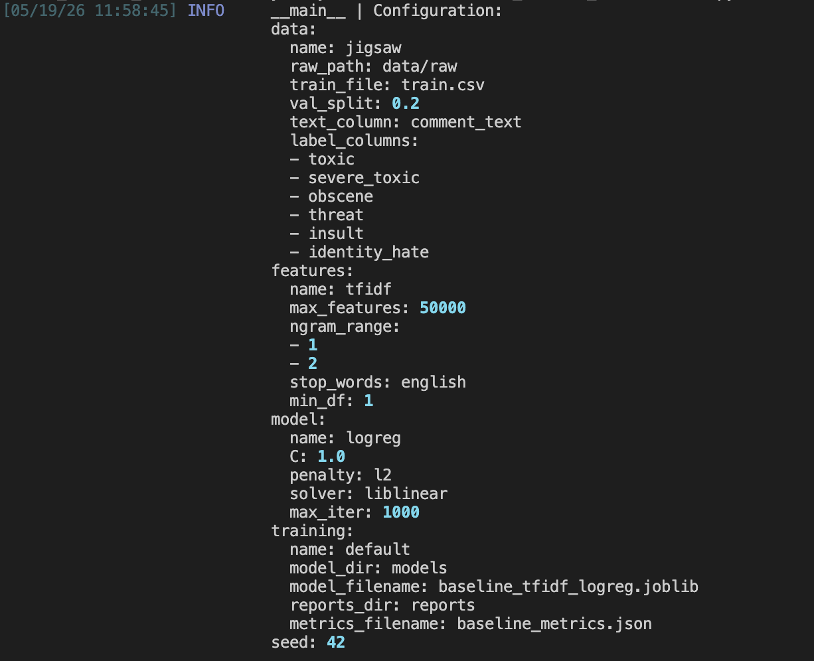

# PHASE 2: Enhancing ML Operations with Containerization & Monitoring

## Overview

Phase 2 focuses on scaling and operationalizing toxic_comment_classifier by implementing containerization, advanced monitoring, profiling, experiment tracking, and comprehensive logging. This phase ensures your model can be reliably deployed, monitored in production, and continuously improved through systematic experimentation.

---

## 1. Containerization

- [ ] **Dockerfile Creation**: Build Dockerfile for model training and inference
- [ ] **Base Image Selection**: Choose appropriate base image (python:3.x, nvidia/cuda, etc.)
- [ ] **Environment Variables**: Define and document required environment variables
- [ ] **Build Instructions**: Document how to build Docker image with examples
- [ ] **Run Instructions**: Document how to run container with proper volume/network config
- [ ] **Container Testing**: Test container locally to ensure consistency with host environment
- [ ] **Docker Compose (Optional)**: Create docker-compose.yml for multi-service setups
- [ ] **Environment Consistency**: Verify that containerized training produces identical results to local training

---

## 2. Monitoring & Debugging

- [ ] **Debugging Tools**: Set up pdb/ipdb for interactive debugging
- [ ] **Debugging Documentation**: Document how to debug in containerized environment
- [ ] **Debug Scenario 1**: Create example scenario and solution document for [specific problem]
- [ ] **Debug Scenario 2**: Create example scenario and solution document for [specific problem]
- [ ] **Logging for Debugging**: Implement detailed logging at critical points in code
- [ ] **Model Assertion Checks**: Add assertions to catch data/model anomalies early
- [ ] **Training Validation**: Implement sanity checks (NaN detection, shape validation, etc.)

---

## 3. Profiling & Optimization

- [ ] **CPU Profiling**: Use cProfile to profile training and inference
- [ ] **Memory Profiling**: Profile memory usage with memory_profiler or similar
- [ ] **GPU Profiling (if applicable)**: Use PyTorch Profiler or similar for GPU workloads
- [ ] **Profiling Results**: Document baseline profiling results and bottlenecks identified
- [ ] **Optimization 1**: Implement and measure optimization (e.g., vectorization, caching)
- [ ] **Optimization 2**: Implement and measure additional optimization
- [ ] **Performance Benchmarks**: Document before/after performance metrics
- [ ] **Optimization Documentation**: Explain each optimization and its impact

---

## 4. Experiment Management & Tracking

- [ ] **MLflow Setup**: Initialize MLflow tracking server and client configuration
  - OR **Weights & Biases Setup**: Initialize W&B project and team workspace
- [ ] **Metric Logging**: Log training/validation metrics for each experiment
- [ ] **Parameter Logging**: Log all hyperparameters and configuration values
- [ ] **Model Artifact Logging**: Save model checkpoints and artifacts to tracking system
- [ ] **Experiment Comparison**: Create comparison of at least 3 different experiments
- [ ] **Visualization**: Generate performance comparison charts/plots
- [ ] **Best Model Selection**: Document criteria and process for selecting best model from experiments
- [ ] **Experiment Documentation**: Create table summarizing all experiments with results

---

## 5. Application & Experiment Logging

- [x] **Logger Setup**: Configure Python logger with appropriate handlers and formatters
- [x] **Rich Library Setup**: Use rich for enhanced console output and logging
- [x] **Log Levels**: Implement and use DEBUG, INFO, WARNING, ERROR appropriately
- [x] **Log Messages**: Add informative log messages at key points in code
- [x] **Training Log Example**: Document and include sample training log output
- [x] **Inference Log Example**: Document and include sample inference log output
- [x] **Error Logging**: Implement comprehensive error logging with context
- [x] **Performance Logging**: Log timing information for performance analysis
- [x] **Log Rotation**: Configure log rotation to prevent disk space issues

### Setup

Logging is centralized in `src/toxic_comment_classifier/logging_config.py`. The `setup_logging()` function attaches two handlers to the root logger:

1. **Console handler** — `rich.logging.RichHandler` with colored levels, timestamps, and pretty tracebacks. Used for interactive development.
2. **File handler** — `logging.handlers.RotatingFileHandler` writing structured plain text to `logs/`. Caps each file at 5 MB and keeps up to 5 backups, so disk usage is bounded at roughly 25 MB total.

Both training (`train_model.py`) and inference (`predict_model.py`) call `setup_logging()` once at the start of `main()`. Inference logs route to a separate file (`logs/prediction.log`) by passing `setup_logging(log_filename="prediction.log")`.

Pretty tracebacks are globally enabled via `rich.traceback.install()` in `train_model.py`'s `main()`, so any uncaught exception during training is rendered with source context instead of Python's default plain traceback.

### Log Levels Used

| Level     | Used For                                                     |
| --------- | ------------------------------------------------------------ |
| `INFO`    | Normal training progress, paths, timing, completion messages |
| `WARNING` | Non-fatal sklearn deprecations or recoverable issues         |
| `ERROR`   | Caught exceptions with context (raised after logging)        |
| `DEBUG`   | Available for verbose tracing, disabled by default           |

### Training Log Example

Excerpt from `logs/training.log`:

```
2026-05-20 11:35:43 | INFO     | __main__ | Configuration:
data:
  name: jigsaw
  raw_path: data/raw
  val_split: 0.2
...
2026-05-20 11:35:44 | INFO     | __main__ | Loading training data from /Users/arya/.../data/raw/train.csv
2026-05-20 11:35:44 | INFO     | __main__ | Training baseline model with 127656 training rows and 31915 validation rows
2026-05-20 11:35:53 | INFO     | __main__ | Model fit completed in 9.13s
2026-05-20 11:35:53 | INFO     | __main__ | Validation prediction completed in 0.71s
2026-05-20 11:35:53 | INFO     | __main__ | Saved model to /Users/arya/.../models/baseline_tfidf_logreg.joblib
2026-05-20 11:35:53 | INFO     | __main__ | Saved metrics to /Users/arya/.../reports/baseline_metrics.json
2026-05-20 11:35:53 | INFO     | __main__ | Hydra run artifacts written to /Users/arya/.../outputs/2026-05-20/11-35-43
2026-05-20 11:35:53 | INFO     | __main__ | Training complete
```

The composed Hydra config is logged at the top of every run, so any teammate reading the log can see exactly which hyperparameters produced the saved model.

### Inference Log Example

Excerpt from `logs/prediction.log`:

```
2026-05-19 11:56:14 | INFO     | __main__ | Loading model from /Users/arya/.../models/baseline_tfidf_logreg.joblib
2026-05-19 11:56:16 | INFO     | __main__ | Loading input data from data/raw/test.csv
2026-05-19 11:56:19 | INFO     | __main__ | Saved predictions to reports/predictions.csv
2026-05-19 11:56:19 | INFO     | __main__ | Prediction complete
```

### Performance Logging

Training time is captured both in the log stream and persisted to `reports/baseline_metrics.json` as `fit_seconds` and `predict_seconds`. Person B (experiment tracking owner) can plot these across runs in MLflow to verify that profiling-driven optimizations actually improve performance.

### Terminal Screenshot

The screenshot below shows Rich's colored output on the developer's terminal: timestamps in dim blue, `INFO` level highlighted, and config values (numbers, booleans) syntax-highlighted.



---

## 6. Configuration Management

- [x] **Hydra Setup**: Install and configure Hydra for config management
- [x] **Config Files**: Create YAML config files for train/eval/inference configurations
- [x] **Config Structure**: Organize configs with appropriate hierarchy (base, model, data, etc.)
- [x] **Config Example 1**: Create and document sample training config
- [x] **Config Example 2**: Create and document alternative config (different hyperparameters)
- [x] **Config Validation**: Implement config validation and schema checking
- [x] **Override Documentation**: Document how to override config values from command line
- [x] **Config Version Control**: Version all configs alongside code

### Setup

Configuration is managed by [Hydra](https://hydra.cc/) (`hydra-core==1.3.2`). The training entrypoint `train_model.py` is decorated with `@hydra.main(version_base="1.3", config_path="../../configs", config_name="config")`, which composes a single `cfg: DictConfig` object from the YAML files at runtime. Every hyperparameter, path, and model knob lives in `configs/`, so no code edits are needed to run a new experiment.

### Config Folder Layout

```
configs/
├── config.yaml              # Root config: defaults list + global seed
├── data/
│   └── jigsaw.yaml          # Dataset paths, split ratio, column names
├── features/
│   └── tfidf.yaml           # TF-IDF vectorizer settings
├── model/
│   └── logreg.yaml          # Logistic Regression hyperparameters
└── training/
    └── default.yaml         # Output paths and filenames
```

Each subfolder is a Hydra **config group**. The root `config.yaml` composes them via a `defaults` list:

```yaml
defaults:
  - data: jigsaw
  - features: tfidf
  - model: logreg
  - training: default
  - _self_

seed: 42
```

Adding a new dataset or model later (for example, `model/distilbert.yaml`) doesn't require touching the training script — just a CLI override.

### Config Validation

Validation is handled implicitly by OmegaConf's type system. When `train_model.py` accesses `cfg.model.C`, OmegaConf raises a clear error if the key is missing or has the wrong type. Hydra also prints the composed config at the top of every run (logged via `OmegaConf.to_yaml(cfg)`), so misconfigurations are visible immediately rather than buried in stack traces.

### Override from the Command Line

Any value in the composed config can be overridden via Hydra's CLI syntax: `key=value` or `group.subkey=value`. No code edits, no flag definitions, no argparse.

**Example 1 — Default run (baseline):**

```bash
python -m toxic_comment_classifier.train_model
```

Uses `C=1.0`, `max_features=50000`, `ngram_range=[1, 2]`, etc., as defined in the YAML files.

**Example 2 — Stronger regularization with a smaller vocabulary:**

```bash
python -m toxic_comment_classifier.train_model model.C=10 features.max_features=20000
```

This produces a distinct run with different hyperparameters, no code changes required. The full override list is automatically saved to the run's `.hydra/overrides.yaml`.

### Run Artifacts and Reproducibility

Every Hydra run creates a timestamped subdirectory under `outputs/<date>/<time>/` containing:

- `.hydra/config.yaml` — the fully composed config used for this run
- `.hydra/overrides.yaml` — any CLI overrides that were passed
- `.hydra/hydra.yaml` — Hydra's own runtime configuration

This means every training run is automatically reproducible: a teammate can read `.hydra/config.yaml` to see exactly which hyperparameters produced a given model artifact, and `.hydra/overrides.yaml` to see what was changed from defaults. The `outputs/` directory is gitignored — the persistent record lives in `models/`, `reports/`, and `logs/`, all anchored to the project root via `hydra.utils.to_absolute_path()`.

### Config Files

For brevity, only the model config is shown here. The remaining four configs follow the same structure and are tracked in git under `configs/`.

`configs/model/logreg.yaml`:

```yaml
name: logreg

# Inverse regularization strength. Smaller = stronger regularization.
C: 1.0

# Regularization type. liblinear solver supports l1 and l2.
penalty: l2

# Optimization algorithm.
solver: liblinear

# Max optimizer iterations.
max_iter: 1000
```

---

## 7. Documentation & Repository Updates

- [ ] **README Update**: Update README to include:
  - [ ] Containerization section with Docker usage
  - [ ] Debugging and profiling guide
  - [ ] Experiment tracking setup instructions
  - [ ] Configuration management guide
  - [ ] Logging usage examples
- [ ] **Architecture Documentation**: Document system architecture with diagrams
- [ ] **Setup Guide**: Update setup guide to include all Phase 2 tools
- [ ] **Examples**: Add examples of running with different configurations
- [ ] **Tool Integration**: Document how all tools work together
- [ ] **Troubleshooting**: Add troubleshooting section for common issues
- [ ] **Performance Guide**: Document how to profile and optimize
- [ ] **Version Compatibility**: Document version requirements for all tools

---

> **Checklist:** Use this as a guide for documenting your Phase 2 deliverables.
