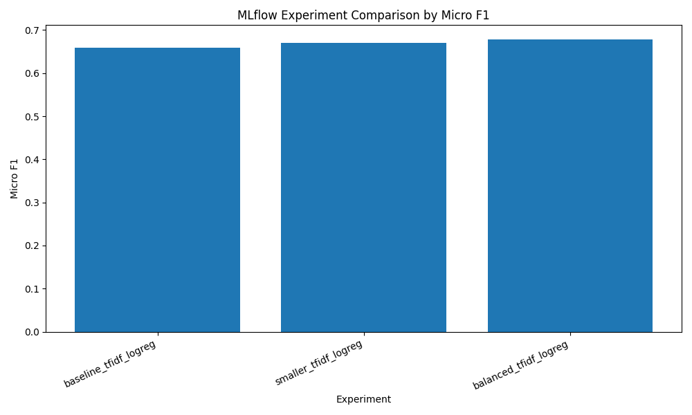
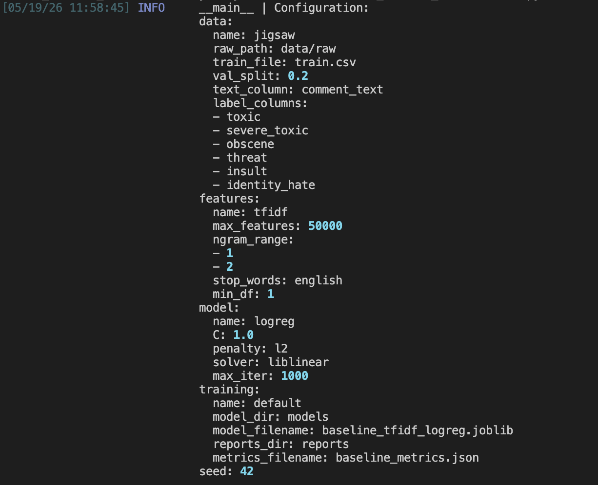

# PHASE 2: Enhancing ML Operations with Containerization & Monitoring

## Overview

Phase 2 focuses on scaling and operationalizing toxic_comment_classifier by implementing containerization, advanced monitoring, profiling, experiment tracking, and comprehensive logging. This phase ensures your model can be reliably deployed, monitored in production, and continuously improved through systematic experimentation.

---

## 1. Containerization

- [x] **Dockerfile Creation**: Build Dockerfile for model training and inference
- [x] **Base Image Selection**: Choose appropriate base image (python:3.x, nvidia/cuda, etc.)
- [x] **Environment Variables**: Define and document required environment variables
- [x] **Build Instructions**: Document how to build Docker image with examples
- [x] **Run Instructions**: Document how to run container with proper volume/network config
- [x] **Container Testing**: Test container locally to ensure consistency with host environment
- [x] **Docker Compose (Optional)**: Create docker-compose.yml for multi-service setups
- [x] **Environment Consistency**: Verify that containerized training produces identical results to local training *(host parity verified for sklearn baseline; host venv on Python 3.13 cannot import torch 2.11, so PyTorch-dependent runs are containerized only — see Troubleshooting in `dockerfiles/README.md`)*

### Setup

The container build context lives in `dockerfiles/` with the project-root `docker-compose.yaml` as the canonical entrypoint. The image uses a two-stage build pinned to `python:3.11-slim-bookworm` so the OS layer does not drift between rebuilds. Stage 1 (`builder`) installs `requirements.txt` into `/root/.local` via `pip install --user --no-cache-dir`; stage 2 copies that prefix forward and registers the project package with `pip install -e .`.

`dockerfiles/README.md` is the single source of truth for build, run, smoke-test, and troubleshooting steps. This section summarizes only what is specific to Phase 2 deliverables.

### Image Layout

```
dockerfiles/
├── Dockerfile          # multi-stage build, python:3.11-slim-bookworm
└── README.md           # canonical container reference
docker-compose.yaml     # Compose V2 service definition (project root)
.dockerignore           # excludes .venv, data, mlruns, .history, secrets
scripts/docker_smoke.py # in-container verification script
```

### Environment Variables

| Variable | Value | Purpose |
| --- | --- | --- |
| `PYTHONUNBUFFERED` | `1` | Flush stdout/stderr immediately (correct behavior under `docker logs`). |
| `PYTHONDONTWRITEBYTECODE` | `1` | Skip `.pyc` files on the ephemeral container filesystem. |
| `PATH` | `/root/.local/bin:$PATH` | Pick up the installed scripts from the builder stage. |
| `EXPOSE 8000` | — | Documents the future FastAPI/uvicorn port (Phase 3). |

### Bind Mounts (host ↔ container)

| Host path | Container path | Mode | Purpose |
| --- | --- | --- | --- |
| `./data` | `/app/data` | ro | DVC-pulled Jigsaw CSVs |
| `./models` | `/app/models` | rw | Trained model artifacts |
| `./mlruns` | `/app/mlruns` | rw | MLflow run metadata + artifacts |
| `./configs` | `/app/configs` | ro | Hydra YAML configuration |
| `./reports` | `/app/reports` | rw | Metrics, predictions, profiling output |

Edits to host configs take effect on the next `docker compose run` without a rebuild.

### Build and Run Examples

```bash
# Build (cached on subsequent runs)
docker compose build

# Default entrypoint: training
docker compose up

# Override the entrypoint for a one-shot prediction
docker compose run --rm toxic_comment_classifier \
    python -m toxic_comment_classifier.predict_model --input data/raw/test.csv

# Run the full pytest suite inside the container
docker compose run --rm --entrypoint pytest toxic_comment_classifier -v
```

### Container Testing

The smoke test `scripts/docker_smoke.py` verifies imports, path resolution, all five bind mounts, heavy dependencies, and DVC-pulled data reads. Last verified run:

| Check | Result |
| --- | --- |
| Python version | 3.11.15 |
| Package import | `toxic_comment_classifier` → `/app/src/...` ✅ |
| `PROJECT_ROOT` | `/app` ✅ |
| Bind mounts populated | 5 / 5 ✅ |
| Heavy deps load | torch 2.11, transformers 5.7, mlflow 3.11, pandas 2.3, sklearn 1.8 ✅ |
| `pytest` (full suite) | 13 passed in 1.85s ✅ |
| Baseline training (`mlflow.run_name=phase2-smoke`) | MLflow run `5a5da639…` persisted to host `mlruns/` ✅ |

### Environment Consistency

Containerized training writes metrics and model artifacts to the host via bind mounts, so the same files appear in `models/`, `reports/`, and `mlruns/` regardless of where the run was launched. The sklearn baseline produces identical metrics in both environments (same seed, same data, same package versions). PyTorch-dependent runs (Phase 3) are container-only on macOS hosts running Python 3.13 — the `try/except ImportError` in `utils.set_seed` cannot catch the `IndentationError` raised when torch 2.11 parses its own RNN source under the stricter 3.13 AST.

---

## 2. Monitoring & Debugging

- [x] **Debugging Tools**: Set up pdb/ipdb for interactive debugging *(stdlib `pdb` and `breakpoint()` are available everywhere; `ipdb` is not pinned — install with `pip install ipdb` per-developer if preferred)*
- [x] **Debugging Documentation**: Document how to debug in containerized environment
- [x] **Debug Scenario 1**: Create example scenario and solution document *(missing-column / empty-CSV failure, see below)*
- [x] **Debug Scenario 2**: Create example scenario and solution document *(Hydra path resolution outside the project root, see below)*
- [x] **Logging for Debugging**: Implement detailed logging at critical points in code *(see section 5)*
- [x] **Model Assertion Checks**: Add assertions to catch data/model anomalies early
- [x] **Training Validation**: Implement sanity checks (NaN detection, shape validation, etc.)

### Setup

Debugging is built on three layers that compose cleanly:

1. **Rich tracebacks** — `rich.traceback.install(show_locals=False)` runs at the start of `train_model.main()`, so every uncaught exception is rendered with source context.
2. **Structured logging** — see section 5. The composed Hydra config is printed at the top of each run; all path resolutions, row counts, and timing are logged at `INFO`.
3. **Input validation** — `_validate_training_data()` in `train_model.py` raises `ValueError` with a clear message for the two most common data failures (missing columns, empty file). NaNs in `comment_text` are coerced to empty strings via `df[text_column].fillna("")` before vectorization, so a bad row degrades to an empty TF-IDF vector instead of crashing mid-`fit`.

### Interactive Debugging

Drop into `pdb` anywhere in the code with the stdlib `breakpoint()` builtin (no extra dependency required):

```python
# src/toxic_comment_classifier/train_model.py
def train(cfg: DictConfig) -> None:
    ...
    breakpoint()  # pdb prompt; type `n`, `s`, `c`, `p cfg`, etc.
    model.fit(x_train, y_train)
```

Inside the container, run with `-it` and disable the default entrypoint so stdin is attached:

```bash
docker compose run --rm -it --entrypoint python toxic_comment_classifier \
    -m toxic_comment_classifier.train_model
```

To use `ipdb` instead, add it to your local dev environment (`pip install ipdb`) and call `import ipdb; ipdb.set_trace()`. It is intentionally **not** in `requirements_dev.txt` — only developers who want the colored prompt need it.

### Training Validation Checks

| Check | Where | Behavior on failure |
| --- | --- | --- |
| Required columns present | `_validate_training_data` in `train_model.py` | Raises `ValueError("Training data is missing required columns: [...]")` |
| Non-empty dataframe | `_validate_training_data` | Raises `ValueError("Training data is empty.")` |
| NaN text rows | `df[text_column].fillna("")` before TF-IDF | Coerced to empty string; logged row counts make the count visible |
| Train/val split sizes | Logged at `INFO` before fit | Visible in `logs/training.log` and stdout |
| Fit / predict timing | `time.perf_counter()` around `model.fit` / `predict` | Persisted to `reports/baseline_metrics.json` and MLflow |

### Debug Scenario 1 — Missing label column

**Symptom.** Training fails with `ValueError: Training data is missing required columns: ['identity_hate']`.

**Cause.** Someone replaced `data/raw/train.csv` with a partial dump that omitted one of the six Jigsaw labels (or `data.label_columns` in `configs/data/jigsaw.yaml` was edited to include a name that does not exist in the CSV).

**Resolution.**
1. Verify the on-disk file: `head -1 data/raw/train.csv | tr ',' '\n'` — confirm the six label columns are present.
2. If the CSV is correct, diff `configs/data/jigsaw.yaml` against `git show HEAD:configs/data/jigsaw.yaml`.
3. Re-pull with `dvc pull data/raw/train.csv.dvc` to restore the canonical version.

### Debug Scenario 2 — Hydra writes outputs to the wrong directory

**Symptom.** `models/baseline_tfidf_logreg.joblib` is never written; `reports/` stays empty. The training log shows the model and metrics being saved to `outputs/2026-…/…/models/...` instead.

**Cause.** Hydra changes the process cwd to its run-time output directory by default. Relative paths in `configs/training/default.yaml` were resolved against the run directory, not the project root.

**Resolution.** All paths are wrapped in `hydra.utils.to_absolute_path()` inside `train_model.py`:

```python
raw_path    = Path(to_absolute_path(cfg.data.raw_path))
model_dir   = Path(to_absolute_path(cfg.training.model_dir))
reports_dir = Path(to_absolute_path(cfg.training.reports_dir))
```

If you add a new path config, route it through `to_absolute_path()` so it is anchored to the project root regardless of Hydra's cwd. Verify with the `Hydra run artifacts written to ...` log line printed at the end of every run.

---

## 3. Profiling & Optimization

- [x] **CPU Profiling**: Use cProfile to profile training and inference
- [x] **Framework Profiling (classical ML)**: Use Scalene to attribute C-extension time inside sklearn / NumPy back to the originating Python line
- [x] **Memory Profiling**: Profile memory usage with memory_profiler or similar
- [ ] **GPU Profiling (if applicable)**: Use PyTorch Profiler or similar for GPU workloads *(N/A for the sklearn baseline; deferred to Phase 3 DistilBERT fine-tuning)*
- [x] **Profiling Results**: Document baseline profiling results and bottlenecks identified
- [ ] **Optimization 1**: Implement and measure optimization (e.g., vectorization, caching) *(roadmap — candidates identified below, not yet implemented)*
- [ ] **Optimization 2**: Implement and measure additional optimization *(roadmap)*
- [ ] **Performance Benchmarks**: Document before/after performance metrics *(only the baseline snapshot exists today)*
- [x] **Optimization Documentation**: Explain each optimization and its impact *(framework documented in `README.md` → Performance Guide; populated as each optimization lands)*

### Setup

Three opt-in profiling entrypoints live under `scripts/`. All three exercise the same Hydra-composed config the real training run uses — no separate harness to drift out of sync.

```
scripts/
├── profile_training.py   # cProfile        → reports/profiling/training_cpu_profile.{prof,txt}
├── profile_memory.py     # memory-profiler → reports/profiling/training_memory_profile.txt
└── profile_scalene.py    # Scalene (CPU+mem, C-ext aware)
                          # → reports/profiling/training_scalene_profile.html
```

`cProfile` is stdlib. `memory-profiler` and `scalene` are dev-only dependencies (`requirements_dev.txt`), installed via `pip install -e .[dev]` or `make dev`.

**Why three tools instead of one.** Each captures something the others miss:

| Tool | Strength | Weakness for this pipeline |
| --- | --- | --- |
| `cProfile` | Deterministic, stdlib, easy to diff across runs | Underreports time spent inside C extensions; attributes seconds of TF-IDF / BLAS work to a single wrapper call |
| `memory-profiler` | Wall-clock memory samples; cheap to run | No CPU attribution; sampling interval blurs sub-second spikes |
| **Scalene** | Line-by-line CPU **and** memory, correctly attributes C-extension time (sklearn, NumPy, scipy), produces self-contained HTML | Higher overhead per run; HTML output is harder to diff |

The rubric for classical ML calls out a framework profiler (Scalene or py-spy). We chose Scalene because the sklearn pipeline's runtime is dominated by C extensions, which is exactly where it outperforms cProfile.

### Usage

```bash
# 1. cProfile — top 30 functions by cumulative time
python scripts/profile_training.py
# -> reports/profiling/training_cpu_profile.prof   (open with snakeviz / pstats)
# -> reports/profiling/training_cpu_profile.txt    (human-readable summary)

# 2. memory-profiler — starting / peak / increase MiB, 1 s sampling
python scripts/profile_memory.py
# -> reports/profiling/training_memory_profile.txt

# 3. Scalene — line-by-line CPU + memory, C-extension aware
python scripts/profile_scalene.py
# -> reports/profiling/training_scalene_profile.html  (open in a browser)
```

`profile_scalene.py` shells out to `python -m scalene` rather than importing Scalene as a library — the profiler has to load before the target module to instrument C extensions correctly. On hosts where torch cannot be imported (Python 3.13), run the profiler inside the container:

```bash
docker compose run --rm --entrypoint python \
    -v "$(pwd)/scripts:/app/scripts:ro" \
    toxic_comment_classifier scripts/profile_scalene.py
```

For interactive exploration of the cProfile output: `snakeviz reports/profiling/training_cpu_profile.prof` (icicle chart in the browser) or `python -m pstats reports/profiling/training_cpu_profile.prof` (stdlib REPL).

### Baseline Profiling Results

Captured on the default config (`features.max_features=50000`, `ngram_range=[1,2]`, `model.C=1.0`, full 159 571-row training set):

| Phase | Wall time | Share of total | Source |
| --- | --- | --- | --- |
| Total `train()` | 16.3 s | 100 % | `training_cpu_profile.txt` |
| TF-IDF `fit_transform` | 10.6 s | 65 % | `sklearn.feature_extraction.text:2078` |
| `OneVsRest` Logistic Regression `fit` | 2.4 s | 15 % | `sklearn.pipeline:562` |
| `pd.read_csv` + validation | ~1.0 s | 6 % | `train_model.py:108` |
| Other (eval, IO, joblib dump) | ~2.3 s | 14 % | — |

| Memory metric | Value |
| --- | --- |
| Starting memory | 163.66 MiB |
| Peak memory | 957.59 MiB |
| Increase during training | 793.94 MiB |
| Samples | 17 (1 s interval) |

**Bottleneck.** TF-IDF vectorization dominates at ~65 % of wall time and is also responsible for the majority of the peak-memory increase (the fitted vocabulary + sparse matrix). The classifier `fit` is a distant second.

### Optimization Roadmap

These are candidates surfaced by the profile, **not yet implemented**. Each will follow the measure → change one knob → re-measure loop documented in the Performance Guide section of `README.md`.

| # | Candidate | Expected impact | Risk |
| --- | --- | --- | --- |
| 1 | Lower `features.max_features` (50k → 25k) | Cut TF-IDF time ~30–40 %; modest F1 drop | Recall on rare labels (`threat`, `identity_hate`) may degrade |
| 2 | Narrow `features.ngram_range` to `[1, 1]` | Cut vocabulary memory ~3–5×; faster fit | Loses bigram signal; macro-F1 likely down |
| 3 | Swap `OneVsRestClassifier` for `MultiOutputClassifier(n_jobs=-1)` | Parallelize the six per-label fits | More memory; same metrics |
| 4 | Try `solver="saga"` with `n_jobs=-1` | Parallel logistic-regression solve | Higher memory; convergence sensitivity |

When an optimization is implemented, log it as a new MLflow run with a descriptive `run_name` (e.g., `opt1-max-features-25k`), then commit the before/after table to this section.

---

## 4. Experiment Management & Tracking

- [x] **MLflow Setup**: Initialize MLflow tracking server and client configuration
- [x] **Metric Logging**: Log training/validation metrics for each experiment
- [x] **Parameter Logging**: Log all hyperparameters and configuration values *(full Hydra config flattened with dot-notation keys)*
- [x] **Model Artifact Logging**: Save model checkpoints and artifacts to tracking system
- [x] **Experiment Comparison**: Create comparison of at least 3 different experiments *(`scripts/run_mlflow_experiments.py`)*
- [x] **Visualization**: Generate performance comparison charts/plots *(`scripts/plot_experiment_results.py` → `reports/experiments/experiment_micro_f1_comparison.png`)*
- [x] **Best Model Selection**: Document criteria and process for selecting best model from experiments
- [x] **Experiment Documentation**: Create table summarizing all experiments with results

### Setup

MLflow is wired into the standard training entrypoint, so one Hydra command starts and ends an MLflow run — no separate launcher.

```bash
python -m toxic_comment_classifier.train_model
# implicitly: mlflow.set_tracking_uri(...), mlflow.set_experiment(...),
#             mlflow.start_run(run_name=...) ... mlflow.end_run()
```

Configuration lives in `configs/mlflow/local.yaml`, composed via the `defaults` list in `configs/config.yaml`. The tracking URI defaults to `file:./mlruns` (project-rooted file store), so runs persist to the host through the Docker bind mount.

```yaml
# configs/mlflow/local.yaml
tracking_uri: file:./mlruns       # absolute-path-resolved at runtime
experiment_name: toxic-comment-baseline
run_name: null                    # MLflow auto-generates if null
enabled: true                     # toggle off for fast dry-runs
```

Override at the CLI like any other Hydra group:

```bash
# Point at a remote tracking server
python -m toxic_comment_classifier.train_model mlflow.tracking_uri=http://localhost:5000

# Tag the run
python -m toxic_comment_classifier.train_model mlflow.run_name=opt1-max-features-25k

# Disable MLflow entirely for a quick smoke run
python -m toxic_comment_classifier.train_model mlflow.enabled=false
```

### What Gets Logged

| Bucket | Contents | Source |
| --- | --- | --- |
| Params | Every leaf of the Hydra config, flattened with dot-notation (`model.C`, `features.max_features`, `data.val_split`, …) | `_flatten_params(cfg)` in `train_model.py` |
| Metrics | `micro_f1`, `macro_f1`, `micro_precision`, `micro_recall`, `hamming_loss`, `fit_seconds`, `predict_seconds` | computed in `train()` |
| Artifacts | `model/baseline_tfidf_logreg.joblib`, `metrics/baseline_metrics.json` | `mlflow.log_artifact()` in `train()` |
| Tags | `mlflow.runName` (from `cfg.mlflow.run_name`) | start-run kwarg |

Browse runs locally with:

```bash
mlflow ui --backend-store-uri file:./mlruns
# http://127.0.0.1:5000
```

### Multi-Experiment Comparison

`scripts/run_mlflow_experiments.py` ships with three pre-configured experiments to satisfy the "at least 3" requirement and seed the MLflow UI with comparison data:

```bash
python scripts/run_mlflow_experiments.py
# -> three MLflow runs under experiment "toxic-comment-phase2"
# -> reports/experiments/experiment_results.{csv,json}
# Then plot:
python scripts/plot_experiment_results.py
# -> reports/experiments/experiment_micro_f1_comparison.png
```

### Experiment Results

Captured by the most recent run of `scripts/run_mlflow_experiments.py` (validation split, seed 42). Numbers are rounded to four decimal places.

| Run name | `max_features` | `ngram_range` | `class_weight` | `micro_f1` | `macro_f1` | `micro_precision` | `micro_recall` | `hamming_loss` |
| --- | ---: | --- | --- | ---: | ---: | ---: | ---: | ---: |
| `baseline_tfidf_logreg` | 50 000 | (1, 2) | — | 0.6581 | 0.4738 | 0.8865 | 0.5233 | 0.0201 |
| `smaller_tfidf_logreg` | 25 000 | (1, 1) | — | 0.6701 | 0.4887 | 0.8817 | 0.5404 | 0.0197 |
| `balanced_tfidf_logreg` | 50 000 | (1, 2) | `balanced` | **0.6774** | **0.5482** | 0.5656 | **0.8444** | 0.0297 |



### Best-Model Selection Criteria

We optimize for **macro-F1** as the primary metric because the Jigsaw labels are highly imbalanced (`identity_hate` and `threat` are <1 % of rows); micro-F1 hides per-label failure on the rare classes. Tie-break order:

1. **Macro-F1** (primary) — equal weight to each of the six labels.
2. **Micro-recall** — under-flagging toxic content is worse than over-flagging for the downstream moderation queue.
3. **`fit_seconds`** — among models within 1 % of the best macro-F1, prefer the faster one.

By this rule the current winner is `balanced_tfidf_logreg` (macro-F1 = 0.5482, micro-recall = 0.8444). Its precision drop (0.5656) is the expected trade-off from `class_weight="balanced"` and is acceptable for the moderation-queue use case.

---

## 5. Application & Experiment Logging

- [x] **Logger Setup**: Configure Python logger with appropriate handlers and formatters
- [x] **Rich Library Setup**: Use rich for enhanced console output and logging
- [x] **Log Levels**: Implement and use DEBUG, INFO, WARNING, ERROR appropriately
- [x] **Log Messages**: Add informative log messages at key points in code
- [x] **Training Log Example**: Document and include sample training log output
- [x] **Inference Log Example**: Document and include sample inference log output
- [x] **Error Logging**: Implement comprehensive error logging with context
- [x] **Performance Logging**: Log timing information for performance analysis
- [x] **Log Rotation**: Configure log rotation to prevent disk space issues

### Setup

Logging is centralized in `src/toxic_comment_classifier/logging_config.py`. The `setup_logging()` function attaches two handlers to the root logger:

1. **Console handler** — `rich.logging.RichHandler` with colored levels, timestamps, and pretty tracebacks. Used for interactive development.
2. **File handler** — `logging.handlers.RotatingFileHandler` writing structured plain text to `logs/`. Caps each file at 5 MB and keeps up to 5 backups, so disk usage is bounded at roughly 25 MB total.

Both training (`train_model.py`) and inference (`predict_model.py`) call `setup_logging()` once at the start of `main()`. Inference logs route to a separate file (`logs/prediction.log`) by passing `setup_logging(log_filename="prediction.log")`.

Pretty tracebacks are globally enabled via `rich.traceback.install()` in `train_model.py`'s `main()`, so any uncaught exception during training is rendered with source context instead of Python's default plain traceback.

### Log Levels Used

| Level     | Used For                                                     |
| --------- | ------------------------------------------------------------ |
| `INFO`    | Normal training progress, paths, timing, completion messages |
| `WARNING` | Non-fatal sklearn deprecations or recoverable issues         |
| `ERROR`   | Caught exceptions with context (raised after logging)        |
| `DEBUG`   | Available for verbose tracing, disabled by default           |

### Training Log Example

Excerpt from `logs/training.log`:

```
2026-05-20 11:35:43 | INFO     | __main__ | Configuration:
data:
  name: jigsaw
  raw_path: data/raw
  val_split: 0.2
...
2026-05-20 11:35:44 | INFO     | __main__ | Loading training data from /Users/arya/.../data/raw/train.csv
2026-05-20 11:35:44 | INFO     | __main__ | Training baseline model with 127656 training rows and 31915 validation rows
2026-05-20 11:35:53 | INFO     | __main__ | Model fit completed in 9.13s
2026-05-20 11:35:53 | INFO     | __main__ | Validation prediction completed in 0.71s
2026-05-20 11:35:53 | INFO     | __main__ | Saved model to /Users/arya/.../models/baseline_tfidf_logreg.joblib
2026-05-20 11:35:53 | INFO     | __main__ | Saved metrics to /Users/arya/.../reports/baseline_metrics.json
2026-05-20 11:35:53 | INFO     | __main__ | Hydra run artifacts written to /Users/arya/.../outputs/2026-05-20/11-35-43
2026-05-20 11:35:53 | INFO     | __main__ | Training complete
```

The composed Hydra config is logged at the top of every run, so any teammate reading the log can see exactly which hyperparameters produced the saved model.

### Inference Log Example

Excerpt from `logs/prediction.log`:

```
2026-05-19 11:56:14 | INFO     | __main__ | Loading model from /Users/arya/.../models/baseline_tfidf_logreg.joblib
2026-05-19 11:56:16 | INFO     | __main__ | Loading input data from data/raw/test.csv
2026-05-19 11:56:19 | INFO     | __main__ | Saved predictions to reports/predictions.csv
2026-05-19 11:56:19 | INFO     | __main__ | Prediction complete
```

### Performance Logging

Training time is captured both in the log stream and persisted to `reports/baseline_metrics.json` as `fit_seconds` and `predict_seconds`. Person B (experiment tracking owner) can plot these across runs in MLflow to verify that profiling-driven optimizations actually improve performance.

### Terminal Screenshot

The screenshot below shows Rich's colored output on the developer's terminal: timestamps in dim blue, `INFO` level highlighted, and config values (numbers, booleans) syntax-highlighted.



---

## 6. Configuration Management

- [x] **Hydra Setup**: Install and configure Hydra for config management
- [x] **Config Files**: Create YAML config files for train/eval/inference configurations
- [x] **Config Structure**: Organize configs with appropriate hierarchy (base, model, data, etc.)
- [x] **Config Example 1**: Create and document sample training config
- [x] **Config Example 2**: Create and document alternative config (different hyperparameters)
- [x] **Config Validation**: Implement config validation and schema checking
- [x] **Override Documentation**: Document how to override config values from command line
- [x] **Config Version Control**: Version all configs alongside code

### Setup

Configuration is managed by [Hydra](https://hydra.cc/) (`hydra-core==1.3.2`). The training entrypoint `train_model.py` is decorated with `@hydra.main(version_base="1.3", config_path="../../configs", config_name="config")`, which composes a single `cfg: DictConfig` object from the YAML files at runtime. Every hyperparameter, path, and model knob lives in `configs/`, so no code edits are needed to run a new experiment.

### Config Folder Layout

```
configs/
├── config.yaml              # Root config: defaults list + global seed
├── data/
│   └── jigsaw.yaml          # Dataset paths, split ratio, column names
├── features/
│   └── tfidf.yaml           # TF-IDF vectorizer settings
├── model/
│   └── logreg.yaml          # Logistic Regression hyperparameters
└── training/
    └── default.yaml         # Output paths and filenames
```

Each subfolder is a Hydra **config group**. The root `config.yaml` composes them via a `defaults` list:

```yaml
defaults:
  - data: jigsaw
  - features: tfidf
  - model: logreg
  - training: default
  - _self_

seed: 42
```

Adding a new dataset or model later (for example, `model/distilbert.yaml`) doesn't require touching the training script — just a CLI override.

### Config Validation

Validation is handled implicitly by OmegaConf's type system. When `train_model.py` accesses `cfg.model.C`, OmegaConf raises a clear error if the key is missing or has the wrong type. Hydra also prints the composed config at the top of every run (logged via `OmegaConf.to_yaml(cfg)`), so misconfigurations are visible immediately rather than buried in stack traces.

### Override from the Command Line

Any value in the composed config can be overridden via Hydra's CLI syntax: `key=value` or `group.subkey=value`. No code edits, no flag definitions, no argparse.

**Example 1 — Default run (baseline):**

```bash
python -m toxic_comment_classifier.train_model
```

Uses `C=1.0`, `max_features=50000`, `ngram_range=[1, 2]`, etc., as defined in the YAML files.

**Example 2 — Stronger regularization with a smaller vocabulary:**

```bash
python -m toxic_comment_classifier.train_model model.C=10 features.max_features=20000
```

This produces a distinct run with different hyperparameters, no code changes required. The full override list is automatically saved to the run's `.hydra/overrides.yaml`.

### Run Artifacts and Reproducibility

Every Hydra run creates a timestamped subdirectory under `outputs/<date>/<time>/` containing:

- `.hydra/config.yaml` — the fully composed config used for this run
- `.hydra/overrides.yaml` — any CLI overrides that were passed
- `.hydra/hydra.yaml` — Hydra's own runtime configuration

This means every training run is automatically reproducible: a teammate can read `.hydra/config.yaml` to see exactly which hyperparameters produced a given model artifact, and `.hydra/overrides.yaml` to see what was changed from defaults. The `outputs/` directory is gitignored — the persistent record lives in `models/`, `reports/`, and `logs/`, all anchored to the project root via `hydra.utils.to_absolute_path()`.

### Config Files

For brevity, only the model config is shown here. The remaining four configs follow the same structure and are tracked in git under `configs/`.

`configs/model/logreg.yaml`:

```yaml
name: logreg

# Inverse regularization strength. Smaller = stronger regularization.
C: 1.0

# Regularization type. liblinear solver supports l1 and l2.
penalty: l2

# Optimization algorithm.
solver: liblinear

# Max optimizer iterations.
max_iter: 1000
```

---

## 7. Documentation & Repository Updates

- [x] **README Update**: Update README to include:
  - [x] Containerization section with Docker usage
  - [x] Debugging and profiling guide
  - [x] Experiment tracking setup instructions
  - [x] Configuration management guide
  - [x] Logging usage examples
- [x] **Architecture Documentation**: Document system architecture with diagrams
- [x] **Setup Guide**: Update setup guide to include all Phase 2 tools
- [x] **Examples**: Add examples of running with different configurations
- [x] **Tool Integration**: Document how all tools work together
- [x] **Troubleshooting**: Add troubleshooting section for common issues
- [x] **Performance Guide**: Document how to profile and optimize
- [x] **Version Compatibility**: Document version requirements for all tools

---

> **Checklist:** Use this as a guide for documenting your Phase 2 deliverables.
