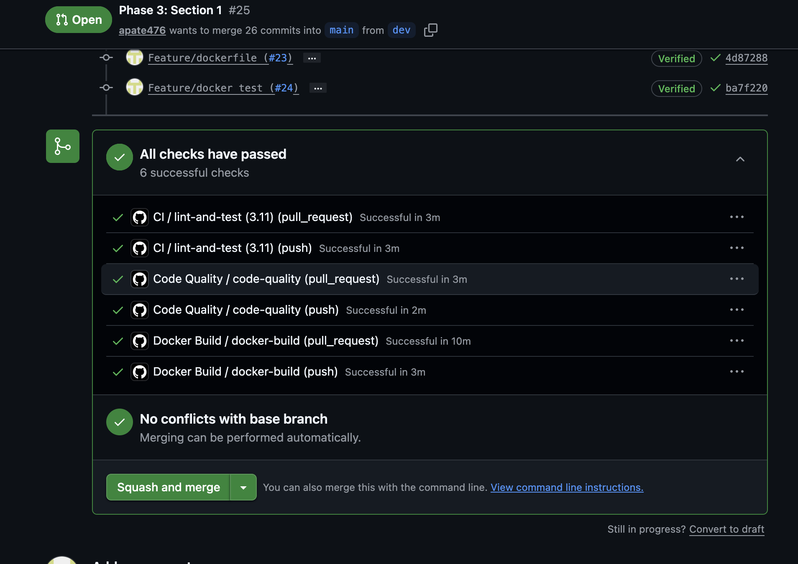
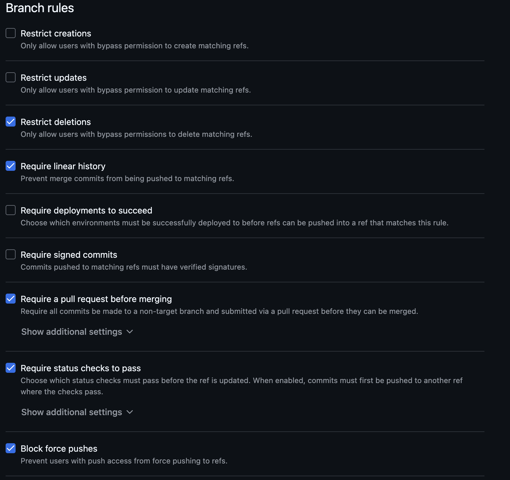

# PHASE 3: Continuous Machine Learning (CML) & Deployment

## Overview

Phase 3 implements continuous integration/continuous deployment (CI/CD) pipelines and productionizes toxic_comment_classifier on cloud infrastructure. This phase covers automated testing, containerized workflows, CML integration, and multi-platform deployment options including GCP, Cloud Run, and serverless functions.

---

## 1. Continuous Integration & Testing

- [x] **Unit Tests**: Write pytest test scripts for data processing and model components
  - File: `tests/test_data.py`, `tests/test_model.py`, `tests/test_training.py`, `tests/test_predict.py`, `tests/test_evaluation.py`, `tests/test_features.py`, `tests/test_utils.py`
  - 56 unit tests covering data loading, model scaffold, training pipeline components, prediction, evaluation metrics, feature engineering, and utilities.

- [x] **Integration Tests**: Create integration tests for full training pipeline
  - File: `tests/test_integration.py`
  - 3 integration tests that run the full `train()` function end-to-end using a minimal in-memory dataset and mock HydraConfig, verifying that the model file and metrics JSON are produced and that the saved model can generate predictions.

- [x] **Test Coverage**: Aim for >80% code coverage with pytest-cov
  - Overall coverage: 90% across all source files.
  - Run locally: `pytest tests/ --cov=toxic_comment_classifier --cov-report=term-missing`

- [x] **GitHub Actions - Tests**: Create workflow for running tests on every push
  - File: `.github/workflows/ci.yml`
  - [x] Triggers on push and PRs to `main` and `dev`
  - [x] Tests across Python 3.10, 3.11, and 3.12
  - [x] Coverage report uploaded to Codecov via `codecov/codecov-action@v3`
  - 

- [x] **GitHub Actions - Code Quality**: Create workflow for:
  - File: `.github/workflows/codecheck.yaml`
  - [x] Running ruff linter
  - [x] Type checking with mypy
  - [x] Formatting checks with ruff format

- [x] **GitHub Actions - Docker Build**: Create workflow for building Docker image
  - File: `.github/workflows/docker.yaml`
  - [x] Builds on PR and push to `main` and `dev`
  - [x] Tests built image by running `python -c "import toxic_comment_classifier; print('OK')"`

- [x] **Pre-commit Hooks**: Set up pre-commit hooks
  - File: `.pre-commit-config.yaml`
  - [x] Formatting with ruff-format
  - [x] Linting with ruff
  - [x] Type checking with mypy
  - [x] Trailing whitespace and end-of-file fixer
  - 
  - 

- [x] **Test Documentation**: Document how to run tests locally and in CI
  - File: `TESTING.md`
  - Covers local test execution, coverage reporting, running specific tests, pre-commit setup, and CI workflow overview.

---

## 2. Continuous Docker Building & CML

- [ ] **Automated Docker Builds**: Configure Docker build pipeline triggered by:
  - [ ] Commits to main branch
  - [ ] Version tags
  - [ ] Manual workflow dispatch
- [ ] **Docker Push**: Implement push to container registry (Docker Hub, GitHub Container Registry, or GCP)
- [ ] **CML Initialization**: Initialize CML in repository
- [ ] **CML Workflow**: Create GitHub Actions workflow for CML that:
  - [ ] Trains model on workflow runner
  - [ ] Generates performance metrics
  - [ ] Creates visualizations/plots
  - [ ] Comments results on PR
- [ ] **CML Metrics Output**: Document format and sample output of CML metrics
- [ ] **CML Plots**: Generate sample plots and document in CML workflow
- [ ] **Model Comparison**: Create CML output showing comparison of current vs. baseline model
- [ ] **Workflow Documentation**: Document CML workflow setup and customization

---

## 3. Deployment on GCP

- [ ] **GCP Project Setup**: Create GCP project and enable necessary APIs
- [ ] **Service Account**: Create service account with appropriate permissions for:
  - [ ] Artifact Registry
  - [ ] Vertex AI
  - [ ] Cloud Run
  - [ ] Cloud Functions
  - [ ] Compute Engine
- [ ] **Artifact Registry**: Set up Artifact Registry for storing Docker images
  - [ ] Create repository in Artifact Registry
  - [ ] Configure authentication from CI/CD
  - [ ] Push Docker images to registry
- [ ] **Vertex AI Training (Option A)**: Set up custom training on Vertex AI
  - [ ] Create training container image
  - [ ] Configure training job specification
  - [ ] Document how to submit training jobs
- [ ] **Compute Engine Training (Option B)**: Set up training on Compute Engine instance
  - [ ] Create VM instance with GPU if needed
  - [ ] Document SSH access and training process
  - [ ] Set up instance for automated training
- [ ] **Model Registry**: Store trained models in GCS bucket with versioning
  - [ ] Create GCS bucket for models
  - [ ] Implement model upload from training
  - [ ] Document model retrieval process
- [x] **FastAPI Service**: Create FastAPI application for model serving
  - Files: `api/main.py`, `api/schemas.py`, `tests/test_api.py`
  - [x] Define inference endpoint(s)
  - [x] Implement request validation
  - [x] Add health check endpoint
  - [x] Document API specification
- [ ] **Cloud Functions Deployment (Option A)**: Deploy inference as Cloud Function
  - [ ] Package model and FastAPI app for Cloud Functions
  - [ ] Create Cloud Function with appropriate memory/timeout
  - [ ] Configure HTTP trigger
  - [ ] Document invocation and response format
- [x] **Cloud Run Deployment (Option B)**: Deploy as containerized service on Cloud Run
  - Files: `dockerfiles/Dockerfile.api`, `requirements-api.txt`, `docs/section3_part2_deployment.md`
  - [x] Create Dockerfile optimized for Cloud Run
  - [ ] Test locally with Cloud Run emulator *(code + instructions ready in `docs/section3_part2_deployment.md`; pending run against the team GCP project)*
  - [ ] Deploy to Cloud Run with auto-scaling *(code + instructions ready in `docs/section3_part2_deployment.md`; pending run against the team GCP project)*
  - [x] Document deployment process
- [x] **Streamlit/Gradio Deployment (Option C)**: Deploy demo app on HuggingFace Spaces
  - Files: `streamlit_demo/app.py`, `streamlit_demo/README.md` (Space config), `docs/section3_part2_deployment.md`
  - [x] Create Streamlit or Gradio interface for model
  - [x] Push to GitHub repository
  - [ ] Deploy to HuggingFace Spaces *(code + instructions ready in `docs/section3_part2_deployment.md`; pending run against the team GCP project)*
  - [x] Document feature walkthrough
- [ ] **Load Testing**: Test deployment with load testing tool (locust, Apache JMeter)
  - [ ] Establish baseline performance metrics
  - [ ] Document scaling characteristics
- [ ] **Monitoring Setup**: Configure Cloud Monitoring and Cloud Logging
  - [ ] Set up log aggregation
  - [ ] Create monitoring dashboards
  - [ ] Set up alerts for anomalies

---

## 4. Documentation & Repository Updates

- [ ] **Comprehensive README**: Update README with:
  - [ ] Architecture diagram showing all components
  - [ ] CI/CD pipeline overview
  - [ ] Deployment instructions for each option (Cloud Run, Cloud Functions, HuggingFace)
  - [ ] GCP setup and configuration guide
  - [ ] How to invoke deployed models
  - [ ] Monitoring and troubleshooting guide
  - [ ] Cost estimation and optimization tips
- [ ] **Deployment Guide**: Create detailed DEPLOYMENT.md
- [ ] **API Documentation**: Document all endpoints
- [ ] **Architecture Documentation**: Include diagrams
- [ ] **Screenshots/Demos**: Add screenshots for all deployed services
- [ ] **Troubleshooting Guide**: Document common errors
- [ ] **Resource Cleanup Reminder**: Create CLEANUP.md
- [ ] **Contributing Guide Update**: Update CONTRIBUTING.md with CI/CD and testing requirements
- [ ] **Changelog**: Maintain CHANGELOG.md

---

> **Checklist:** Use this as a guide for documenting your Phase 3 deliverables.
